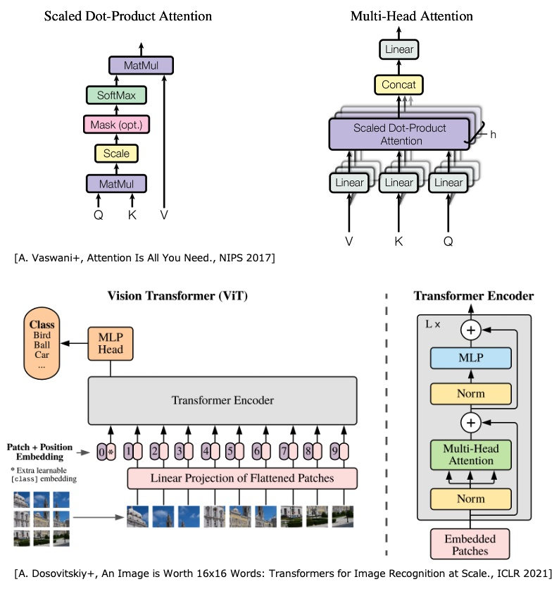

# Vision Transformer (ViT)

- ref. [lucidrains/vit-pytorch](https://github.com/lucidrains/vit-pytorch)
- ref. [huggingface/pytorch-image-models/blob/main/timm/models/vision_transformer.py](https://github.com/huggingface/pytorch-image-models/blob/main/timm/models/vision_transformer.py)
- [A. Vaswani+, Attention Is All You Need., NeurIPS 2017](https://arxiv.org/abs/1706.03762)
- [A. Dosovitskiy+, An Image is Worth 16x16 Words: Transformers for Image Recognition at Scale., ICLR 2021](https://arxiv.org/abs/2010.11929)

